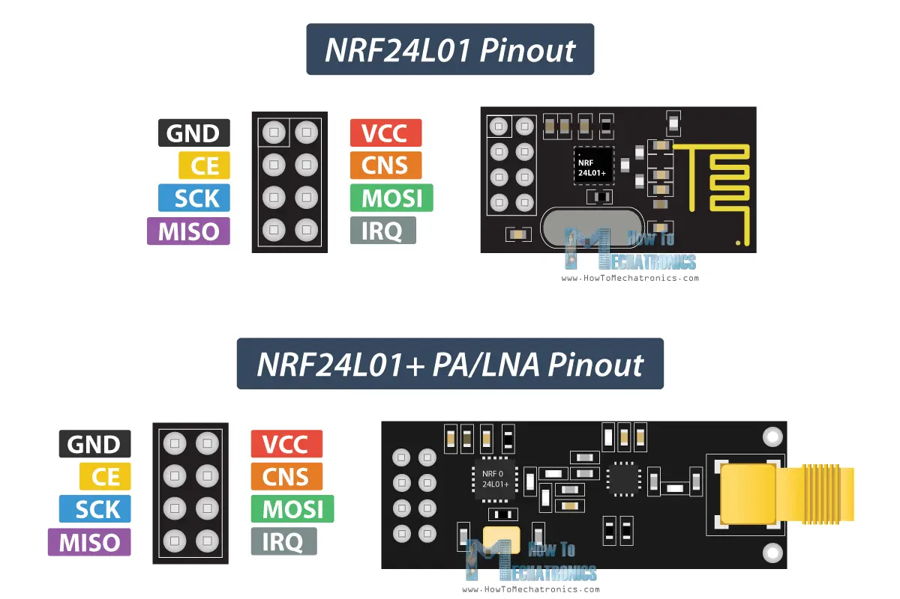
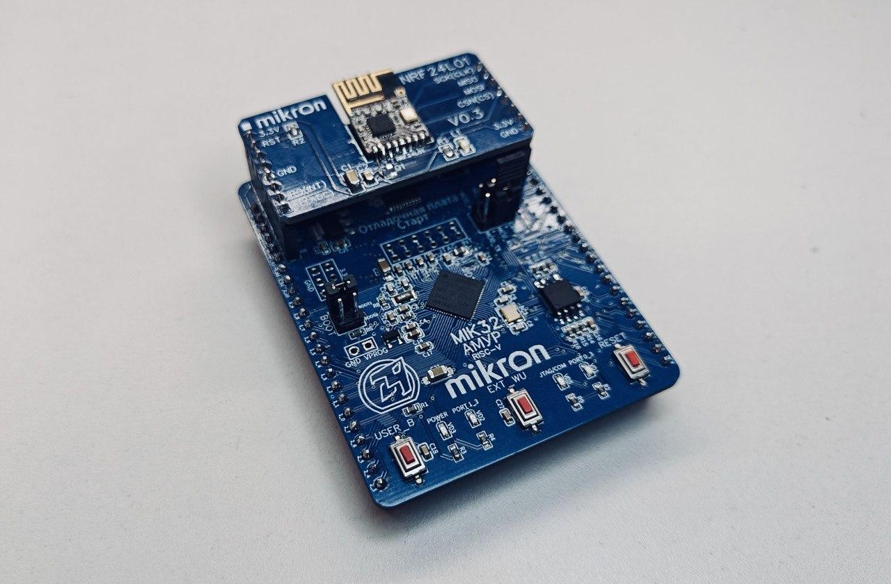

# NRF24L01 драйвер для MIK32
Драйвер позволяет микроконтроллеру MIK32 общаться с радиомодулями на основе чипа NRF24L01, реализующего беспроводную радиосвязь в диапазоне 2400 МГц.

## Структура репозитория
Репозиторий оформлен в виде проекта PlatformIO. Драйвер состоит из заголовочного файла (NRF24L01_MIK32.h), размещаемого в папке "include" и файла с исходным кодом (NRF24L01_MIK32.c), размещаемого в папке "src". В папке "src" также содержится файл main.c, содержащий пример работы с радиомодулем.

## Подключение радиомодуля к MIK32
Чип NRF24L01 общается с внешним миром через интерфейс SPI (MISO, MOSI, SCK, CS (CNS)). Данный драйвер использует сугубо аппаратный SPI, соответсвенно выбор пинов для подключения невелик - или это SPI0, или SPI1.
Также необходимым для работы является пин CE, задающий режим работы радиомодуля. Линию IRQ подключать необязательно, это линия прерываний, активный уровень у нее - низкий. Ее следует использовать если так и хочется словить прерывание по событию завершения приема или завершению передачи. Иначе, можно читать внутренние флаги статуса NRF.
В примере кода, изложенном в src/main.c, можно задать задать параметры подключения в дефайнах.

В случае работы с платами Mikron Старт, можно использовать готовый модуль NRF24L01 от Mikron, чем немного облегчить свою жизнь.

## Основные характеристики радиомодуля
- Пропускная способность: от 250 кбит/с (поддерживается только NRF24L01+), 1Мбит/с, 2 Мбит/с
- Размер пакета: 0-32 байта
- Время передачи пакета минимальное: 15 мс
- Частоты работы: 126 каналов от 2400 до 2525 МГц
- NRF24L01 поддерживает технологию MultiServer, которая позволяет в рамках одного частотного канала содержать до 6 логических. Драйвер имеет возможность одному модулю NRF принимать информацию от 5 других.
- При передаче каждого пакета может передаваться также контрольная сумма (CRC) длиной 8 или 16 байт
- Подключение модуля идет через SPI, также требуется 1 пин GPIO для управления линией CE
- NRF24L01 может генерировать прерывания по событиям завершения передачи, завершения приема и ошибки
